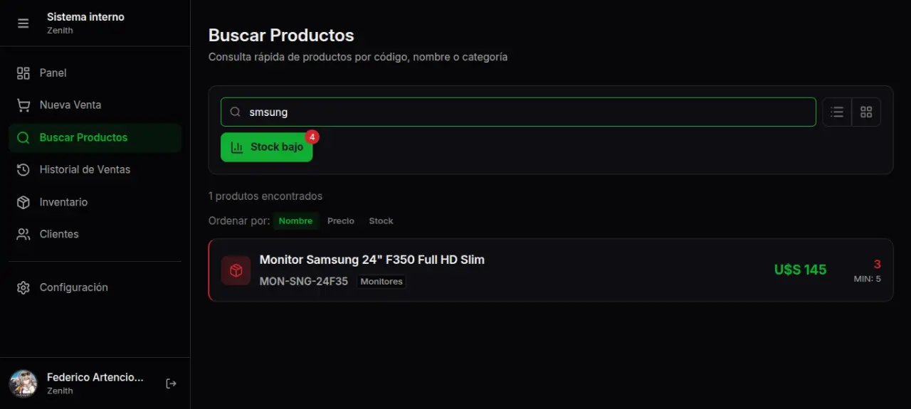
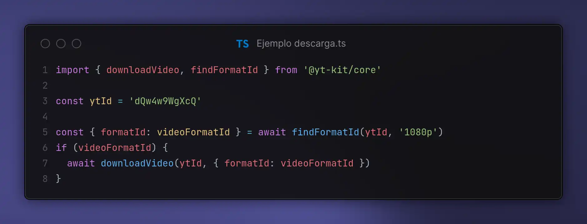

<h3 align='center' size='big'>¡Hola! Soy mAngo 👋</h3>

  

 

Me gusta la buena UX, el rendimiento, y programar

  
  

<h3>Mis proyectos principales</h3>

<table width="100%" align="center">
  <tr>
    <td width="50%" align="center">
      <a href="https://github.com/Ubiufboeuf/zenith">
        
         
        <b>Zenith</b>
      </a>
    </td>
    <td width="50%" align="center">
      <a href="https://github.com/Ubiufboeuf/monado">
        
         
        <b>Monado</b>
      </a>
    </td>
  </tr>
  <tr>
    <td colspan='2' align="center">
     
      <a href="https://github.com/Ubiufboeuf/yt-kit">
        
         
        <b>@yt-kit/core</b>
      </a>
    </td>
  </tr>
</table>
